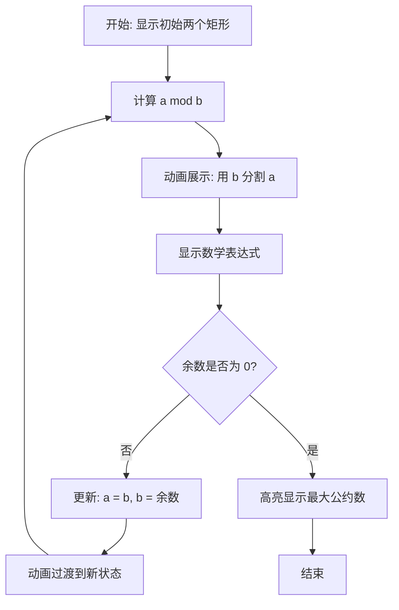

# 设计文档

## 概述

本设计文档描述了如何使用 revideo 框架创建辗转相除法（欧几里得算法）的动画演示。该动画将通过矩形面积的可视化方式展示算法过程，配合数字标注和数学表达式，帮助用户直观理解算法的工作原理。

设计采用经典的"矩形分割"可视化方法：用两个不同大小的矩形代表两个数字，通过反复"切割"较大矩形来展示取余操作，直到找到最大公约数。

## 架构

### 文件结构

```
packages/examples/src/
├── euclidean-algorithm.ts          # 项目入口文件
└── scenes/
    └── euclidean-algorithm.tsx     # 场景实现文件
```

### 技术栈

- **revideo/core**: 核心动画引擎，提供 `makeProject`、`tween`、`all`、`chain` 等函数
- **revideo/2d**: 2D 图形组件，提供 `Rect`、`Txt`、`Layout` 等组件
- **TypeScript**: 类型安全的开发语言
- **React/JSX**: 声明式 UI 组件语法

## 组件和接口

### 主要组件

#### 1. 矩形组件 (Rect)
用于表示数字的几何图形。

**属性：**
- `width`: 矩形宽度，与数值成正比
- `height`: 矩形高度，固定值以保持视觉一致性
- `fill`: 填充颜色，用于区分不同的数字
- `stroke`: 边框颜色
- `lineWidth`: 边框宽度
- `position`: 位置坐标

#### 2. 文本组件 (Txt)
用于显示数字标注和数学表达式。

**属性：**
- `text`: 显示的文本内容
- `fontSize`: 字体大小
- `fill`: 文字颜色
- `fontFamily`: 字体族
- `fontWeight`: 字体粗细

#### 3. 布局组件 (Layout)
用于组织和排列多个元素。

**属性：**
- `layout`: 布局模式（如 'row', 'column'）
- `gap`: 元素间距
- `alignItems`: 对齐方式

### 核心函数

#### 算法可视化函数

```typescript
function* visualizeEuclideanStep(
  a: number,
  b: number,
  rectA: Rect,
  rectB: Rect,
  labelA: Txt,
  labelB: Txt,
  expression: Txt
): Generator
```

**功能：** 执行并可视化算法的一步
**参数：**
- `a`, `b`: 当前的两个数字
- `rectA`, `rectB`: 对应的矩形引用
- `labelA`, `labelB`: 数字标签引用
- `expression`: 数学表达式文本引用

**返回：** Generator（用于 yield* 语法）

#### 辅助函数

```typescript
function calculateScale(a: number, b: number): number
```
**功能：** 根据输入数字计算合适的缩放比例，确保图形在画布范围内

```typescript
function formatExpression(a: number, b: number, quotient: number, remainder: number): string
```
**功能：** 格式化数学表达式字符串（如 "48 = 18 × 2 + 12"）

## 数据模型

### 算法状态

```typescript
interface AlgorithmState {
  a: number;           // 当前被除数
  b: number;           // 当前除数
  step: number;        // 当前步骤编号
  quotient: number;    // 商
  remainder: number;   // 余数
  isComplete: boolean; // 算法是否完成
}
```

### 可视化配置

```typescript
interface VisualizationConfig {
  // 初始输入
  initialA: number;
  initialB: number;
  
  // 视觉参数
  baseScale: number;        // 基础缩放比例
  rectHeight: number;       // 矩形固定高度
  colorA: string;           // 数字 A 的颜色
  colorB: string;           // 数字 B 的颜色
  colorGCD: string;         // 最大公约数的高亮颜色
  
  // 动画参数
  stepDuration: number;     // 每步动画时长（秒）
  transitionDuration: number; // 过渡动画时长（秒）
  pauseDuration: number;    // 步骤间暂停时长（秒）
}
```

### 默认配置

```typescript
const DEFAULT_CONFIG: VisualizationConfig = {
  initialA: 48,
  initialB: 18,
  baseScale: 10,
  rectHeight: 80,
  colorA: '#e13238',
  colorB: '#4a90e2',
  colorGCD: '#4caf50',
  stepDuration: 1.5,
  transitionDuration: 0.8,
  pauseDuration: 0.5,
};
```

## 算法流程

### 欧几里得算法伪代码

```
function gcd(a, b):
  while b ≠ 0:
    temp = b
    b = a mod b
    a = temp
  return a
```

### 可视化流程



### 详细步骤

#### 步骤 1: 初始化场景
1. 创建两个矩形，宽度分别为 `a * scale` 和 `b * scale`
2. 添加数字标签显示 a 和 b 的值
3. 使用淡入动画展示所有元素

#### 步骤 2: 迭代可视化
对于每一步算法执行：

1. **计算阶段**
   - 计算商 `q = floor(a / b)`
   - 计算余数 `r = a mod b`

2. **可视化阶段**
   - 在矩形 A 上叠加 q 个矩形 B 的轮廓（虚线）
   - 高亮显示剩余部分（余数对应的矩形）
   - 显示数学表达式：`a = b × q + r`

3. **过渡阶段**
   - 淡出矩形 A
   - 将矩形 B 移动到 A 的位置
   - 将余数矩形移动到 B 的位置
   - 更新数字标签

4. **更新状态**
   - `a = b`
   - `b = r`

#### 步骤 3: 完成动画
1. 当余数为 0 时，当前的 b 值即为最大公约数
2. 高亮显示最终矩形（改变颜色为 `colorGCD`）
3. 显示结果文本：`GCD = b`
4. 添加缩放动画强调结果

## 动画设计

### 动画时间轴

```
时间轴（以 a=48, b=18 为例）：

0.0s  - 1.0s  : 淡入初始矩形和标签
1.0s  - 1.5s  : 暂停，让用户观察初始状态
1.5s  - 3.0s  : 第一步：显示 48 = 18 × 2 + 12
3.0s  - 3.8s  : 过渡：更新为 a=18, b=12
3.8s  - 4.3s  : 暂停
4.3s  - 5.8s  : 第二步：显示 18 = 12 × 1 + 6
5.8s  - 6.6s  : 过渡：更新为 a=12, b=6
6.6s  - 7.1s  : 暂停
7.1s  - 8.6s  : 第三步：显示 12 = 6 × 2 + 0
8.6s  - 9.4s  : 高亮显示 GCD = 6
9.4s  - 11.4s : 结果展示和强调动画
```

### 缓动函数选择

- **位置移动**: `easeInOutCubic` - 平滑的加速和减速
- **透明度变化**: `easeInOutQuad` - 柔和的淡入淡出
- **缩放动画**: `easeOutBack` - 带有轻微回弹效果，强调结果
- **颜色过渡**: `easeInOutCubic` - 平滑的颜色变化

### 关键动画效果

#### 1. 分割可视化
```typescript
// 显示如何用 b 分割 a
for (let i = 0; i < quotient; i++) {
  yield* rectB.clone()
    .position([startX + i * bWidth, startY])
    .opacity(0.5)
    .stroke('#ffffff')
    .lineWidth(2)
    .lineDash([5, 5]);
}
```

#### 2. 余数高亮
```typescript
yield* all(
  remainderRect.fill(colorB, 0.5),
  remainderRect.scale(1.05, 0.3).to(1, 0.3),
);
```

#### 3. 状态过渡
```typescript
yield* all(
  rectA.opacity(0, transitionDuration),
  rectB.position(rectA.position(), transitionDuration, easeInOutCubic),
  remainderRect.position(rectB.position(), transitionDuration, easeInOutCubic),
  labelA.text(b.toString(), transitionDuration),
  labelB.text(remainder.toString(), transitionDuration),
);
```

## 布局设计

### 画布布局

```
+--------------------------------------------------+
|                                                  |
|              辗转相除法可视化                      |
|                                                  |
|  +----------------+  +--------+                  |
|  |      48        |  |   18   |                  |
|  |   (矩形 A)     |  | (矩形B) |                  |
|  +----------------+  +--------+                  |
|                                                  |
|         48 = 18 × 2 + 12                         |
|                                                  |
|  [动画展示分割过程]                               |
|                                                  |
|  步骤 1 / 3                                      |
|                                                  |
+--------------------------------------------------+
```

### 坐标系统

- **原点**: 画布中心 (0, 0)
- **矩形 A 初始位置**: (-300, 0)
- **矩形 B 初始位置**: (100, 0)
- **标签位置**: 矩形上方 20px
- **表达式位置**: (0, 200)
- **步骤指示器位置**: (0, 300)

## 错误处理

### 输入验证

```typescript
function validateInput(a: number, b: number): void {
  if (a <= 0 || b <= 0) {
    throw new Error('输入必须是正整数');
  }
  if (!Number.isInteger(a) || !Number.isInteger(b)) {
    throw new Error('输入必须是整数');
  }
  if (a > 1000 || b > 1000) {
    console.warn('输入数字较大，可能影响可视化效果');
  }
}
```

### 边界情况处理

1. **a < b**: 算法第一步会自动交换，无需特殊处理
2. **a = b**: 第一步即得到结果，动画正常展示
3. **b = 1**: 会有多次迭代，确保动画不会过长
4. **大数字**: 自动缩放以适应画布

## 测试策略

### 单元测试

虽然本项目主要是可视化演示，但可以测试核心逻辑：

```typescript
describe('Euclidean Algorithm Logic', () => {
  test('计算 GCD(48, 18) = 6', () => {
    expect(gcd(48, 18)).toBe(6);
  });
  
  test('计算 GCD(100, 35) = 5', () => {
    expect(gcd(100, 35)).toBe(5);
  });
  
  test('处理 a < b 的情况', () => {
    expect(gcd(18, 48)).toBe(6);
  });
});

describe('Helper Functions', () => {
  test('计算合适的缩放比例', () => {
    const scale = calculateScale(1000, 500);
    expect(scale).toBeLessThan(1);
  });
  
  test('格式化数学表达式', () => {
    const expr = formatExpression(48, 18, 2, 12);
    expect(expr).toBe('48 = 18 × 2 + 12');
  });
});
```

### 视觉测试

1. **手动测试**: 运行动画，检查视觉效果
2. **不同输入测试**: 测试多组不同的输入值
   - 小数字: (12, 8)
   - 中等数字: (48, 18)
   - 大数字: (270, 192)
   - 互质数: (17, 13)
   - 相等数: (24, 24)

### 性能测试

- 确保动画流畅，帧率稳定在 60fps
- 测试大数字输入时的性能表现
- 检查内存使用情况

## 可扩展性

### 未来增强功能

1. **交互控制**
   - 添加暂停/播放按钮
   - 添加步进控制（上一步/下一步）
   - 允许用户输入自定义数字

2. **多种可视化模式**
   - 线段模式：使用线段代替矩形
   - 网格模式：使用方格阵列
   - 动态图模式：展示算法的递归树

3. **教育功能**
   - 添加语音解说
   - 显示算法复杂度分析
   - 对比其他 GCD 算法

4. **导出功能**
   - 导出为视频文件
   - 导出为 GIF 动画
   - 生成可嵌入的 Web 组件

## 技术决策

### 为什么选择矩形而不是线段？

**优点：**
- 面积更直观，易于理解"分割"概念
- 可以在矩形内部显示数字
- 视觉冲击力更强

**缺点：**
- 占用空间较大
- 对于大数字需要更多缩放

**决策：** 使用矩形，但保持固定高度，只改变宽度，兼顾直观性和空间效率

### 为什么使用 tween 而不是内置的属性动画？

**原因：**
- `tween` 提供更精细的控制
- 可以在动画过程中执行自定义逻辑
- 便于同步多个元素的动画
- 符合项目中其他示例的编码风格

### 颜色方案选择

- **红色 (#e13238)**: 代表被除数，醒目
- **蓝色 (#4a90e2)**: 代表除数，与红色形成对比
- **绿色 (#4caf50)**: 代表最终结果，表示成功/完成

这些颜色在色盲用户中也能区分，符合无障碍设计原则。

## 依赖关系

```typescript
// 外部依赖
import {makeProject} from '@revideo/core';
import {
  Circle,
  Rect,
  Txt,
  Layout,
  makeScene2D,
} from '@revideo/2d';
import {
  createRef,
  tween,
  all,
  chain,
  waitFor,
  easeInOutCubic,
  easeOutBack,
  map,
} from '@revideo/core';
```

所有依赖都来自 revideo 框架，无需额外安装第三方库。

## 性能考虑

### 优化策略

1. **对象复用**: 使用对象池复用矩形组件，避免频繁创建销毁
2. **条件渲染**: 只渲染当前可见的元素
3. **动画优化**: 使用 GPU 加速的属性（transform, opacity）
4. **内存管理**: 及时清理不再使用的引用

### 预期性能指标

- **帧率**: 60 FPS
- **内存占用**: < 100 MB
- **渲染时间**: 每帧 < 16ms
- **总动画时长**: 10-15 秒（取决于输入）
